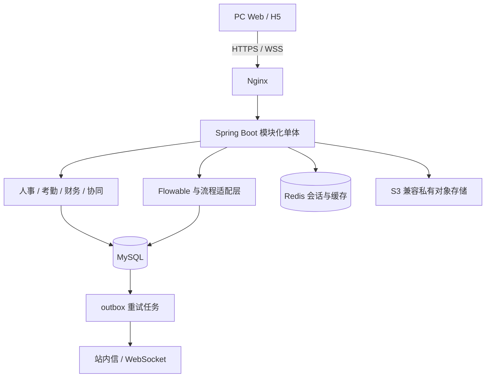

# 03 · 技术架构

> 版本：v1.1（设计草案）
> 更新日期：2026-10-02
> 实施状态（2026-10-02）：M0 基础工程已落地，实际版本、命令、接口与验证见 [09 · 底座使用与验收](09-foundation.md)。本文尚未标注实现的业务能力仍为设计。

## 1. 架构基线

采用模块化单体、单组织部署、共享 MySQL 事务。M0 已采用 RuoYi-Vue-Plus 5.6.2，并独立集成和验证 Flowable 7.2.0。首版不承诺 SaaS 多租户、微服务、分库分表或 Kubernetes。

MySQL 保存业务事实和持久通知，Redis 不承担唯一业务账本。对象存储只保存文件内容，授权关系在数据库中维护。单机 Compose 便于试点，但主机故障会导致服务中断；备份不等于高可用。

## 2. 版本与模块边界

| 组件 | 建议 | M0 要求 |
|---|---|---|
| Java / Spring Boot / MyBatis-Plus / Sa-Token | 跟随选定底座支持矩阵 | 锁定具体版本，验证依赖冲突 |
| Flowable | 与底座兼容的受维护版本 | 验证共享数据源与事务管理器 |
| Vue 3 / TypeScript / Vite / npm | 底座配套前端 | 保存锁文件、固定 Node 与包管理器版本 |
| MySQL | 支持 JSON、CHECK、ngram 的受维护 8.x 版本 | 在确切镜像上执行迁移测试 |
| Redis / S3 兼容存储 | 受维护版本 | 固定镜像摘要和许可记录 |
| 表单 / BPMN 设计器 | 首版固定模板和受控配置 | 高级拖拽设计、复杂网关按 P1 评估 |

计划目录为 `agentoa-backend/`、`agentoa-frontend/`、`agentoa-uniapp/`、`deploy/`，均已落地（移动端为 uni-app 3 实现，H5 与微信小程序双端构建；目录名以实际交付 `agentoa-uniapp` 为准）。先保留底座模块名和目录结构，以包或模块隔离 OA 业务，避免为了统一命名进行全量重构。

| 业务域 | 权威数据与责任 |
|---|---|
| 系统 / HR | 系统账号与部门复用底座；HR 管理员工档案和人事异动 |
| WF | 流程发布版本、引擎调用、操作审计；不直接拥有财务/考勤账本 |
| AT | 班次、打卡、请假、额度与流水、日报 |
| FN | 报销明细、发票占用、付款登记；预算为 P1 |
| NC | 公告、接收范围、已读、统一站内信 |
| KB / CL | 知识空间授权、文档版本；日程、预约和任务 |
| RP | 按权限读取各域事实/汇总，统一指标口径，不修改原始数据 |
| AI | 模型渠道/Key、统一模型网关、对话与用量治理；RAG/Copilot/Agent 只读各域数据并经其服务授权，不拥有业务事实 |

Controller 负责协议和参数检查，Service 承担对象授权、业务规则和事务，Mapper 负责参数化 SQL。模块通过应用服务/接口交互，跨模块编排放在组合层，避免流程模块与业务模块循环依赖。

## 3. 关键流程与一致性

### 3.1 提交业务申请

1. 认证并检查发起范围、附件归属和业务对象权限。
2. 校验 `Idempotency-Key` 与请求摘要，锁定业务单据版本；已提交不能再次创建流程。
3. 读取已发布的流程定义与表单版本，服务器校验字段并计算时长/总金额。
4. 同一事务保存业务单据、冻结请假额度或占用发票，启动指定版本的 Flowable 实例，建立 `wf_instance` 关联并写入 outbox。
5. 事务提交后返回实例 ID；后台消费者写入 `nc_message`，再推送 WebSocket。

Flowable 与业务必须使用同一数据源和 Spring 事务管理器，启动失败时全体回滚。若未来拆库，需另行设计补偿机制，不能继续声称原子提交。

### 3.2 审批与业务终态

`POST /api/v1/wf/tasks/{id}/complete` 只接受 `agree` 或 `reject`。服务端重新读取引擎任务、校验实际办理人/候选人、锁定业务版本，再执行流转。引擎任务是执行状态的权威来源；`wf_task` 仅为可重建的查询投影，不能作为审批授权依据。

流程正常结束不自动等于“审批通过”。必须根据经过校验的审批结果，分别处理通过、拒绝、撤销和管理员终止；审批状态、额度结算和 outbox 在同一事务中提交。冲突返回 HTTP 409，同一幂等请求重试返回原结果。通知失败不回滚已完成的审批。

通过后将额度从冻结转为已用，拒绝/撤销释放冻结；账本流水按业务事件唯一去重。拒绝后修改重提要生成新流程实例和新提交序号，保留原历史。转办记录操作历史，任务继续待处理；退回、加签、会签和挂起为 P1，实施前补充状态转换和并发测试。

流程模板上线后不可修改历史版本；`wf_instance` 固定 `definition_id`、`form_id` 和表单快照。业务实体保留草稿，流程实例只在提交成功后产生。

### 3.3 打卡与考勤

使用服务器接收时间和组织时区确定考勤日。跨夜班归属班次开始日；保存原始打卡，按规则版本重算日报。迟到、早退、缺卡可同时存在，不能用一个互斥枚举覆盖全部异常。

H5 定位必须在 HTTPS 下获得用户授权；普通浏览器不能可靠获取或验证 WiFi SSID。客户端定位、设备信息均为风险信号，不能作为不可伪造证据。首版支持固定班与经确认的定位/IP 规则，轮班、外勤拍照等按需求阶段实施。

### 3.4 会议预约与文档编辑

预约在事务中锁定会议室记录，再以 `existing.start < new.end AND existing.end > new.start` 检查有效预约，写入成功后释放锁。所有修改、取消和释放预约的路径使用同一锁协议。仅“查询后插入”不能防止并发冲突。

文档保存提交当前版本号，条件更新失败返回 409。正式保存与历史版本插入在同一事务内，`(document_id, version)` 唯一；回滚生成新版本，不覆盖旧记录。自动草稿与正式历史分开。

## 4. 消息与实时协议

首版统一 **原生 WebSocket JSON 消息**，不混用 STOMP/SockJS。具体路径和消息体见 [API 第 12 节](05-api-spec.md#12-websocket-接口)。

- 业务事务只写 `sys_outbox`，消费者以唯一事件 ID 写入 `nc_message`，再尝试推送。
- 站内信始终持久化，不以连接是否在线决定是否落库；不另建 `wf_message`。
- outbox 有状态、重试次数、下次执行时间及错误摘要。重复消费不生成重复通知，失败超限进入人工处理队列。
- WebSocket 是实时提示，不是消息送达凭据。重连后按站内信列表补拉，消息 ID 用于客户端去重；已读通过 REST 接口提交。
- 多实例时，调度任务需要数据库抢占/锁，推送需要跨实例路由；不能只扩容容器就假定消息和定时任务正确。

## 5. 认证、权限与数据保护

### 5.1 认证

首版采用 **Sa-Token 不透明 Bearer 会话令牌 + Redis**，不要求 JWT，不设计未经验证的刷新令牌接口。默认绝对有效期 2 小时、空闲超时 30 分钟，过期重新登录；不同端会话策略在 M0 验证。退出、账号冻结、密码重置和权限变更需撤销相应会话或使权限缓存失效。

密码在 HTTPS 通道中提交原值，由服务器使用 BCrypt 验证；禁止把 MD5/Bcrypt 字符串当作前端密码协议。Web 客户端优先内存持有令牌，禁止写入 URL、日志或持久缓存。WebSocket 使用短时、单次 ticket，不能在查询参数中携带长期 Bearer 令牌。

### 5.2 对象与字段授权

RBAC 权限只控制操作入口，还必须校验对象归属、部门范围或空间成员身份。详情、搜索、附件、导出、历史记录与统计使用同一授权规则。超级管理员管理系统不自动获得薪资、身份证和银行账号明文权限。

部门范围使用底座经过验证的数据权限实现和参数化查询，不拼接客户端提供的 SQL。普通员工默认仅查看本人业务记录；主管的组织范围与具体审批任务权限分别判断。首版单组织，不把零散 `tenant_id` 字段视为已实现多租户隔离。

### 5.3 敏感字段与文件

敏感字段使用带认证的加密方案（如 AES-256-GCM），保存 nonce、密钥版本及密文；密钥与数据库分离并有恢复与轮换方案。需要唯一性/精确匹配的手机号、身份证，另存规范化值的 HMAC 索引，不能用普通哈希抵御低熵字典枚举，也不声称支持密文模糊查询。薪资密文使用字符/二进制列，不能放入 DECIMAL。

附件通过 `sys_file` 记录对象键、大小、类型、归属、上传人及校验和。对象桶私有；首版经业务接口鉴权后代理下载，不向用户返回容器内部 URL 或永久公开链接。允许外部签名链接时需单独验证外部域名、签名、有效期和撤权窗口。

上传限制统一为单文件 20 MiB；分片大文件为 P1。富文本按允许列表净化，搜索高亮只允许受控标签；上传内容、文件名和导出单元格需防止脚本或公式注入。

### 5.4 输入与审计

表单格式为项目自定义 schema（含 `schemaVersion`、`fields`），不宣称自动兼容标准 JSON Schema。后端校验字段类型、只读字段和选项范围，金额/时长由服务端计算。数据源仅使用白名单业务查询，禁止用户编写任意 SQL、脚本或可访问 Spring Bean 的表达式。BPMN 导入禁用外部实体并限制服务任务、表达式和可执行类。

记录关键操作、授权失败、审批意见与变更前后业务状态；过滤密码、令牌、密文密钥和敏感正文。留存期按数据类别及组织政策确定，法务冻结优先；不得宣称固定三年删除即可满足某项法规。

## 6. 数据、缓存与迁移

业务新表使用 BIGINT ID，API 全部以字符串传输；底座主键类型在 M0 对齐。数据库时间统一 UTC，界面和考勤按 `Asia/Shanghai` 展示和归日。金额存 DECIMAL，API 用两位小数字符串；请假额度与时长使用整数分钟。

数据库设计中的 DDL 是草案。底座表先读取实际结构，再编写增量迁移，不能盲目重复添加头像等列。选择一个版本化迁移工具，CI 在空库和上一版本库执行升级验证，生产不依赖应用启动时自动改表。

Redis 中会话与可丢弃缓存需区分容量策略。首版可统一使用 `noeviction` 并监控容量，写入失败显式失败；不得用 `allkeys-lru` 随意驱逐会话。数据库仍是授权与业务事实来源，缓存键包含用户/权限范围且变更后失效。

## 7. 可用性与运维边界

建议试点目标：月可用性 99.5%、备份恢复 RPO ≤ 24 小时、RTO ≤ 4 小时，必须通过实际演练确认。30 天月份的 99.5% 对应最多 3.6 小时不可用；定义以用户核心接口探测为准，计划维护计入停机。

MySQL 提交持久化建议 `innodb_flush_log_at_trx_commit=1`、`sync_binlog=1`。需要更短 RPO 时必须实施并验证 binlog 异地归档；仅开启 binlog 不构成恢复方案。对象文件、数据库、配置和加密密钥需能恢复到一致时间点。

单盘 SeaweedFS、单实例自动重启或 MySQL 副本均不能单独等同高可用。多机故障切换、集群对象存储和 K8s 按可用性目标、压测结果及运维能力决策，不以员工人数作机械阈值。

## 8. 验证与开发约定

M0 验证底座构建、认证、权限和共享事务；M1/M2 优先验证重复审批、额度冻结与释放、发票冲突、付款幂等；M3 验证空间越权、文档并发和预约冲突；M4 完成压测、H5 真机测试与恢复演练。

监控覆盖延迟分位数、错误率、连接池、磁盘、outbox 积压、备份时效和证书到期。健康和指标接口仅向容器网络或受控运维入口开放，不通过公网通配路由暴露。

后续代码仓库建议主分支配合短期特性分支，合并前执行相应测试、构建和迁移检查。接口路径、响应、错误及幂等以 [API 规范](05-api-spec.md) 为唯一契约来源，避免在架构中复制一套不同路径。

## 9. AI 能力架构（M1–M5）

新增 `ruoyi-modules/agentoa-ai` 模块（包 `org.dromara.agentoa.ai`），以 LangChain4j + `langchain4j-open-ai` 接入 OpenAI 兼容协议厂商（DeepSeek/Qwen/Kimi/GLM/Ollama 等）。详细分期需求见 [21 · AI 能力需求与分期计划](21-module-plan-ai.md)。

模型调用统一走网关链路：`业务层(M2–M5) → AiModelRouter（路由/降级） → LlmGateway（限额/日志/超时/重试） → LangChain4j ChatModel`，禁止业务代码直连上游 HTTP。API Key 双通道解析：`secret_ref`（环境变量/`configtree:/run/secrets`）优先，其次库中 AES-256-GCM 密文解密；明文永不回显、永不落日志。多模态输入仅对 `capability` 含 `vision` 的模型开放。

安全边界沿用既有约定：对话/知识内容按用户与授权服务端过滤（无权限即 404）；模型出站地址仅限管理员配置的 `base_url`（防 SSRF）；M4 Copilot 只出建议、人工确认后才落业务数据；M5 工具以调用者身份执行并照常走对象权限，写操作工具需额外授权与人工确认。流式对话复用 SSE（`text/event-stream`，绕过响应 envelope），附件复用 `sys_file` + 私有 S3。

相关文档：[需求](02-requirements.md) · [数据库](04-database-design.md) · [部署](06-deployment.md)
